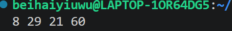
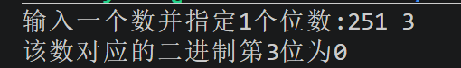
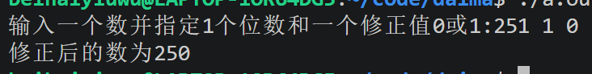
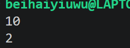
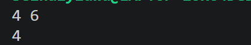
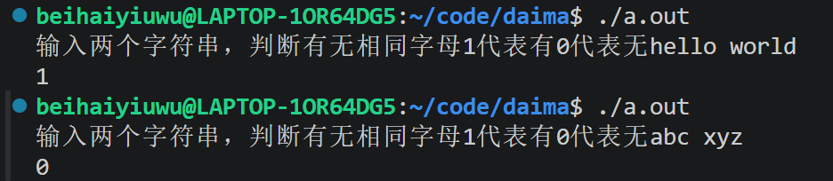
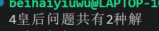
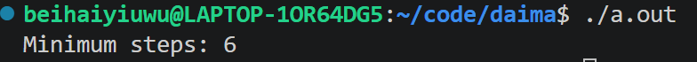

# 模块1
1. 211的二进制位11010011
2. 10110110的十进制位为182
2. 用这个数除以2取余，即用该数%2，结果为1为奇数，结果为0为偶数。
# 模块2
1. 
```c
#include <stdio.h>

int main() {
    unsigned char a = 12;  // 二进制: 00001100
    unsigned char b = 25;  // 二进制: 00011001

    unsigned char res1 = a & b;
    unsigned char res2 = a | b;
    unsigned char res3 = a ^ b;
    unsigned char res4 = (a << 2) | (b >> 1);

    printf("%d %d %d %d\n", res1, res2, res3, res4);
    return 0;
}
```   
输出为8 29 21 60  
运行图片  

* 第一个按位与同1为1否则为0，只有从左往右第5位都位1，其余位0，对应二进制为00001000，十进制为18。
* 第二个按位或有1则为1，对应二进制位00011101，十进制为29，输出29。
* 第三个按位异或，不同位1，从左往右第4，6，8不同，为00010101，输出对应十进制为21。
* 第4个a左移2位后为00110000，b右移2位后位00001100，再按位与后对应二进制为0001111000，十进制即为60。跑一遍程序后也是如此。
2. 
```c
#include<stdio.h>
int main(void)
{
    int m,a;
    printf("输入一个数并指定1个位数:");
    scanf("%d%d",&m,&a);
    int b=((m>>(a-1))&1);//与1进行按位与得当位数
    printf("该数对应的二进制第%d位为%d\n",a,b); 
    return 0;   
}
 
```  

3. 
```c
#include<stdio.h>
int main(void)
{
    int m,a,t;
    printf("输入一个数并指定1个位数和一个修正值0或1:");
    scanf("%d%d%d",&m,&a,&t);
    if(t==1)
    {
      m=m|(1<<(a-1));//该位上变为1
    }
    else
    {
      m=m&~(1<<(a-1));//该位上变为0
    }
    printf("修正后的数为%d\n",m); 
    return 0;   
}
```

4. 
```c
#include<stdio.h>
int main(void)
{
  int x,i;
  scanf("%d",&x);
  for(i=0;i<=31;i++)
  {
    if(((x>>i)&1)==1)//如果哪位为1
    break;
  }
  int m=1<<i;//左移i位
  printf("%d\n",m);
}
```  

5. 
```c
#include<stdio.h>
int main(void)
{
 unsigned int a,b;
 int count=0;
 scanf("%u%u",&a,&b);
 while(a!=b)
 {
     a=a>>1;
     b=b>>1;
     count++;
  
 }
 unsigned int m=a<<count;
 printf("%d\n",m);
 return 0;
}
```  
  
* 要求出这个区间所有数的按位与，即找到a与b二进制相同最高位的1，再在1后面补原先位数的0，因为这个区间数的二进制必须有一位全部相同且为1，当前位才是1，而这位也必须是a和b的最高位。
1. 逻辑运算和位运算的区别和联系。  
* 区别在于两者的对象不同，位运算操作的是一串二进制数字，一位一位的算。逻辑运算连接的是两表达式，也就是对真（1）和假（0）之间的判断运算，整体运算，同时还有短路特点，前面一个成立或不成立后面就不会再判断了。同时返回值也不一样，位运算能返回任意整数，逻辑运算只能返回0或1。
* 联系在于两者都是基于二进制进行运算，位运算是每一位都是0或1进行运算，而逻辑运算是整体性的，多个真假即01间的整体判断，每个0或1都代表一个表达式的整体真假。还有就是两者都可以进行条件判断，只不过就大部分都是逻辑运算。
2. 位运算的性质
* 第一个是运算律的性质，满足交换律分配律结合律（与数学很类似），还有一个特殊的德摩根律（~(a|b)=-a&-b和~（a&b）=-a|-b），这个就跟高中学的集合好像。
* 第二个是和0或全1的运算以及和自己的运算，如a^a==0（清0运算）。还有一个是两次异或同一个数，回到原值（a^b^b=a）。
* 左移位相当于乘以2，右移位相当于除以2。
3. 算数右移与逻辑右移
* 算数右移针对有符号数，逻辑右移针对无符号数，算数右移主要针对的是负数。两种移位的区别在于右移后最左边补什么，算数右移左边补符号位，负数补1，正数补0，而逻辑右移统一补0。对于负数而言，计算机存储运行的是它的补码，即它所对应正数取反码再加1。在n位字长的二进制系统中，用2的n次方-x来表示负数x的二进制编码。算术右移最左边的1代表符号位，表示这个数是正数还是负数，负数不补1就变正数了。负数算数右移1位表示将该负数除以2（向下取整），同时左补1，以保证右移后的数还是负数。对于整数而言算术右移与逻辑右移无区别，最左边都是补0，正数的符号位就是0。
# 模块3
```c
#include <stdio.h>
#include<string.h>
// 请补全以下代码
int hasCommonChar(const char *s1, const char *s2) 
{
    int mask1 = 0;
    int mask2 = 0;
    int m,n;
    for(int i=0;i<strlen(s1);i++)
    {
        m=s1[i]-'a';
        mask1=mask1|(1<<m);
    }
    for(int i=0;i<strlen(s2);i++)
    {
        n=s2[i]-'a';
        mask2=mask2|(1<<n);
    }
    for(int i=0;i<26;i++)
    {
      int d=(mask1>>i)&1;
      int c=(mask2>>i)&1;
      if(d!=0&&c!=0)
      {
      if(d==c)
      {
        return 1;
      }
      else
      {
        continue;
      }
      }
    }
     return 0;
}
int main(void)
{
  char s1[100];
  char s2[100];
  printf("输入两个字符串，判断有无相同字母1代表有0代表无:");
  scanf("%s%s",s1,s2);
  int m=hasCommonChar(s1,s2) ;
  printf("%d\n",m);
  return 0;

}
 
```

* 这道题思路就是跟着提示走，先把字符串中每个字符存储为一个二进制数，a则第一位为1，b则第2位为1。第二步是判断这两个字符串分别得到的数字的该位上的数字是否相同，同时还要避免都为0的情况。如果都为1则返回1，否则返回0。
# 模块4
```c
#include<stdio.h>
#define N 4
int f1(int limit,int col,int left,int right)
{
    if(col==limit)
    {
        return 1;
    }
    int ban=col|left|right;//该位置的限制，1代表不能放，0代表可放
    int candidate=limit&(~ban);//在限制范围内，1代表可放，0代表不可放，limit起限制作用
    int place=0;//代表已经占用了位置的皇后
    int a=0;//多少种可能
    while(candidate!=0)//当该行放满了返回a
    {
        place=candidate&(-candidate);//取最右边的1
        candidate^=place;//将最右边的1变为0
        a+=f1(limit,col|place,(left|place)<<1,(right|place)>>1);//换行，下一种情况
    }
    return a;
    
}
int fanhui(int n)
{
    if(n<1)//显然n<1不成立
    {
        return 0;
    }
    int limit=(1<<n)-1;//将限制转化成二进制，限制为几后面就几个1，方便得可放的皇后
    return f1(limit,0,0,0);//返回几种情况
}


int main(void)
{
    int i=fanhui(N);
    printf("%d皇后问题共有%d种解\n",N,i);
    return 0;
}
```
  
* 整体来讲这道题的思路就是将列，左上到右下，左下到右上这三种情况用一串二进制数字表示起来，place用1表示位置已被占用，0表示未占用，递归时将这个位置传下去。竖向的化直接传，斜方向的要向左或右移动，表示下一行的占位情况。还有一种写法是数组，但会增加时间复杂度，要用很多循环进行占位判断，相较而言位运算时间和速度更快。
# 模块5
```c
#include <stdio.h>
#include <stdbool.h>

// 定义简单队列结构用于 BFS
typedef struct {
    int pos;   // 当前节点编号 (0~15)
    int dist;  // 到达当前节点的最短步数
} Node;

int minStepsToCheese(int walls) {
    int start = 0;
    int target = 15;

    // 如果起点或终点本身是墙，直接不可达
    if ((walls & (1 << start)) || (walls & (1 << target)))
    {
        return -1;
    }

    // BFS 队列与访问位图
    Node queue[16];
    int front = 0, rear = 0;
    int visited = 0;

    // 起点入队并标记已访问 (请使用位运算)
    queue[rear++] = (Node){start, 0};
    visited |= (1 << start);

    // 上、下、左、右四个方向的节点偏移量
    int dr[4] = {-1, 1, 0, 0};
    int dc[4] = {0, 0, -1, 1};

    //请在TO DO 和END OF TO DO 行之间补全代码：
    //TO DO
    while(front<rear)//直到整个队满了停下
    {
        Node cur=queue[front++];//出队
        if(cur.pos==target)//第一次到达终点就是最短步骤
        {
            return cur.dist;//返回步数
        }
        int row=(cur.pos)/4;//算当前行
        int col=(cur.pos)%4;//算当前列
        for(int i=0;i<4;i++)//上下左右四周都遍历一下
        {
            int x=row+dc[i];//算行
            int y=col+dr[i];//算列
            int next=x*4+y;//四周的节点编号
            if(x>=0&&x<4&&y>=0&&y<4&&!(visited&(1<<next)))//没有超出边界，并且没有被访问过
            {
                visited|=(1<<next);//先使用二进制标记
                queue[rear++]=(Node){next,++cur.dist};//新节点入队，储存在队列数组中
            }

        }

    }

    //END OF TO DO

    return -1; // 无法到达
}

int main() {
    int walls = (1 << 5) | (1 << 10); // 5号和10号格子是墙
    int steps = minStepsToCheese(walls);
    printf("Minimum steps: %d\n", steps); // 应输出 6
    return 0;
}
``` 

运行结果  

* BFS的思路是先进先出，先入队的先出去，入队和出队靠的是数组queue，每个数组储存的结构体有着当前编号和步数。使用前要先判断队是否满了，满了的话front=rear，就装不下了。没满的话就吧上次循环存的出队，并且判断是否到达target，到了就返回步数（第一次到返回的就是最小步数）。然后根据4*4网格来看，算出当前的横坐标和纵坐标，同时为了遍历四周，横轴坐标一次加1减1，一般来说是按照顺时针方向。这之后进行判断，算出四周的节点编号，满足没有超出边界并且没有被访问过就可以入队了，但是必须先标记再入队，一般来说满足条件的有1个或2个，必然有2个是不满足条件的。
* BFS用单纯数组也可以实现，把访问过的标记储存在相应编号下标的数组中，记作1。显然使用位运算更加快捷和简便，占用的内存空间相对少一点。

